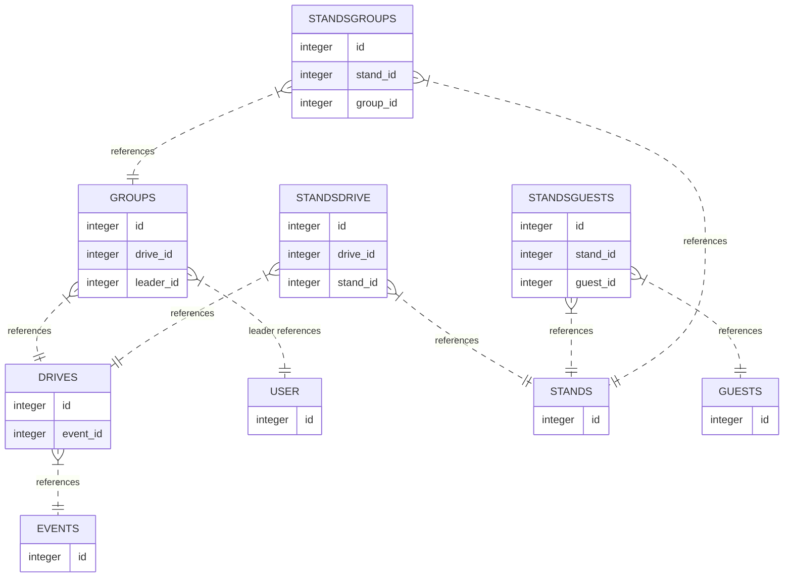

```mermaid
erDiagram
    EVENTS {
        integer id
    }
    
    DRIVES {
        integer id
        integer event_id
    }
    DRIVES }|..|| EVENTS : "references"
    
    GROUPS {
        integer id
        integer drive_id
        integer leader_id
    }
    GROUPS }|..|| DRIVES : "references"
    GROUPS }|..|| USER : "leader references"
    
    STANDS {
        integer id
    }
    
    GUESTS {
        integer id
    }
    
    USER {
        integer id
    }
    
    STANDSDRIVE {
        integer id
        integer drive_id
        integer stand_id
    }
    STANDSDRIVE }|..|| DRIVES : "references"
    STANDSDRIVE }|..|| STANDS : "references"
    
    STANDSGUESTS {
        integer id
        integer stand_id
        integer guest_id
    }
    STANDSGUESTS }|..|| STANDS : "references"
    STANDSGUESTS }|..|| GUESTS : "references"
    
    STANDSGROUPS {
        integer id
        integer stand_id
        integer group_id
    }
    STANDSGROUPS }|..|| STANDS : "references"
    STANDSGROUPS }|..|| GROUPS : "references"

```