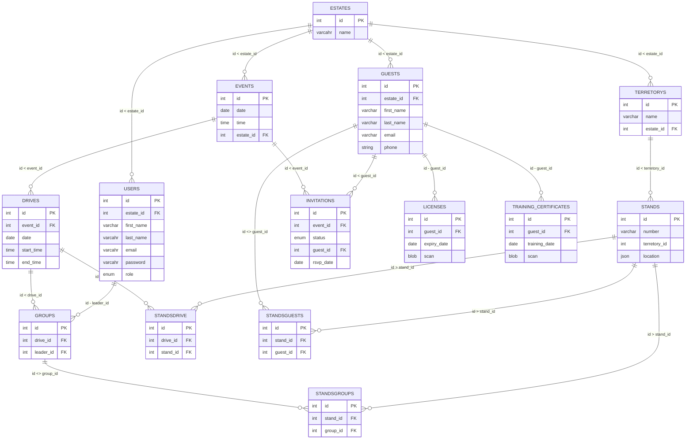

# Database
## Setup

## ERD 

```mermaid
    erDiagram

    GUESTS {
        int id PK
        int estate_id FK
        varchar first_name
        varchar last_name
        varchar email
        string phone
    }
    
    USERS {
        int id PK
        int estate_id FK
        varchar first_name
        varcahr last_name
        varcahr email
        varcahr password
        enum role
    }

    ESTATES {
        int id PK
        varcahr name
    }

    TERRETORYS {
        int id PK
        varchar name
        int estate_id FK
    }

    EVENTS {
        int id PK
        date date
        time time
        int estate_id FK
    }

    DRIVES {
        int id PK
        int event_id FK
        date date
        time start_time
        time end_time
    }

    GROUPS {
        int id PK
        int drive_id FK
        int leader_id FK
    }

    STANDS {
        int id PK
        varchar number
        int terretory_id
        json location
    }

    INVITATIONS {
        int id PK
        int event_id FK
        enum status
        int guest_id FK
        date rsvp_date
    }

    LICENSES {
        int id PK
        int guest_id FK
        date expiry_date
        blob scan
    }

    TRAINING_CERTIFICATES {
        int id PK
        int guest_id FK
        date training_date
        blob scan
    }

    STANDSDRIVE {
        int id PK
        int drive_id FK
        int stand_id FK
    }

    STANDSGUESTS {
        int id PK
        int stand_id FK
        int guest_id FK
    }

    STANDSGROUPS {
        int id PK
        int stand_id FK
        int group_id FK
    }

    GUESTS ||--o{ INVITATIONS : "id < guest_id"
    GUESTS ||--o{ LICENSES : "id - guest_id"
    GUESTS ||--o{ TRAINING_CERTIFICATES : "id - guest_id"
    USERS ||--o{ GROUPS : "id - leader_id"
    ESTATES ||--o{ USERS : "id < estate_id"
    ESTATES ||--o{ GUESTS : "id < estate_id"
    ESTATES ||--o{ TERRETORYS : "id < estate_id"
    ESTATES ||--o{ EVENTS : "id < estate_id"
    TERRETORYS ||--o{ STANDS : "id < terretory_id"
    EVENTS ||--o{ INVITATIONS : "id < event_id"
    EVENTS ||--o{ DRIVES : "id < event_id"
    DRIVES ||--o{ GROUPS : "id < drive_id"
    STANDS ||--o{ STANDSDRIVE : "id > stand_id"
    STANDS ||--o{ STANDSGUESTS : "id > stand_id"
    STANDS ||--o{ STANDSGROUPS : "id > stand_id"
    DRIVES ||--o{ STANDSDRIVE : "id <> drive_id"
    GUESTS ||--o{ STANDSGUESTS : "id <> guest_id"
    GROUPS ||--o{ STANDSGROUPS : "id <> group_id"
    
```