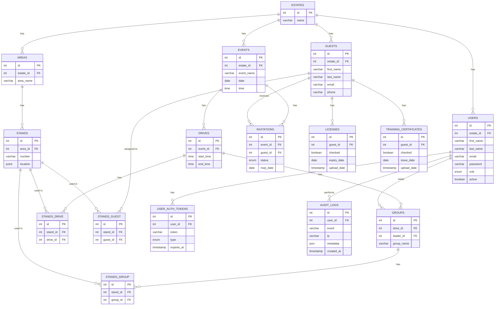

# Hunt Hub — Backend

A hunting estate event management platform built with **Node.js**, **TypeScript**, **Express**, and **Drizzle ORM** with a **PostgreSQL** database (local via Docker or cloud via Neon).

---

## 🧱 Tech Stack

| Layer | Technology |
|---|---|
| Runtime | Node.js |
| Language | TypeScript |
| Framework | Express.js |
| ORM | Drizzle ORM |
| Database | PostgreSQL (Docker locally, Neon in production) |
| Templating | EJS |
| Auth | Session-based (connect-pg-simple) |
| Email | Nodemailer + Mailgun (EU) |
| Security | Helmet, bcrypt, rate limiting |
| Validation | Zod |

---

## 📋 Prerequisites

- **Node.js** v18 or higher
- **npm**
- **Docker** (for local database)
- **Git**

---

## 🚀 Getting Started

### 1. Clone the repository

```bash
git clone https://github.com/carl-castell/hunt-hub_backend.git
cd hunt-hub_backend
```

### 2. Install dependencies

```bash
npm install
```

### 3. Configure environment variables

```bash
cp .env.example .env
```

Fill in the values in `.env` — see the [Environment Variables](#-environment-variables) section below.

### 4. Start the local database

```bash
docker compose up -d
```

### 5. Push the schema to the database

```bash
npm run db:push
```

### 6. Seed the database

```bash
npm run db:seed
```

> ⚠️ You will be prompted to confirm before any data is deleted.

### 7. Start the development server

```bash
npm run dev
```

The server will be available at `http://localhost:3000`.

---

## 🌍 Environment Variables

Copy `.env.example` to `.env` and fill in the values.

| Variable | Description |
|---|---|
| `DB_PROVIDER` | `local` for Docker, `neon` for Neon cloud |
| `LOCAL_DATABASE_URL` | PostgreSQL connection string for local Docker |
| `NEON_DATABASE_URL` | PostgreSQL connection string for Neon |
| `NODE_ENV` | `development` or `production` |
| `SESSION_SECRET` | Strong random string for session encryption |
| `DOMAIN` | Base URL of the app (used for activation links) |
| `MAILGUN_SMTP_USER` | Mailgun SMTP username |
| `MAILGUN_SMTP_PASSWORD` | Mailgun SMTP password |
| `MAIL_FROM` | From address for outgoing emails |
| `ADMIN_FIRST_NAME` | Admin user first name (used by seeder) |
| `ADMIN_LAST_NAME` | Admin user last name (used by seeder) |
| `ADMIN_EMAIL` | Admin user email (used by seeder) |
| `ADMIN_PASSWORD` | Admin user password (used by seeder) |
| `SEED_MOCK_DATA` | `true` to seed mock data, `false` to skip |

---

## 🧑‍💻 Scripts

| Script | Description |
|---|---|
| `npm run dev` | Start development server with hot reload |
| `npm run build` | Compile TypeScript to `dist/` |
| `npm start` | Run compiled production build |
| `npm run db:push` | Push schema to local database |
| `npm run db:push:neon` | Push schema to Neon database |
| `npm run db:gen` | Generate a new migration from schema changes |
| `npm run db:seed` | Seed the database (with confirmation prompt) |
| `npm run db:clear` | Clear all data from the database |
| `npm run db:reset` | Full reset: restart Docker, push schema, seed |
| `npm run studio` | Open Drizzle Studio (database GUI) |

---

## 🗄️ Database

### Dual database support

| Environment | Driver | Variable |
|---|---|---|
| Local (Docker) | `pg` | `LOCAL_DATABASE_URL` |
| Production (Neon) | `@neondatabase/serverless` | `NEON_DATABASE_URL` |

Switch between them by setting `DB_PROVIDER=local` or `DB_PROVIDER=neon` in `.env`.

### ERD



---

## 🔐 Roles

| Role | Access |
|---|---|
| `admin` | Full access — manages estates and users |
| `manager` | Estate-scoped access |
| `staff` | Limited estate-scoped access |

---

## ❓ Troubleshooting

| Problem | Solution |
|---|---|
| Can't connect to database | Make sure Docker is running: `docker compose up -d` |
| Session not persisting | Check `NODE_ENV` — use `development` locally |
| Email not sending | Check `MAILGUN_SMTP_USER` and `MAILGUN_SMTP_PASSWORD` in `.env` |
| Port already in use | Run `lsof -i :3000` and kill the process |
| Schema out of sync | Run `npm run db:push` |
